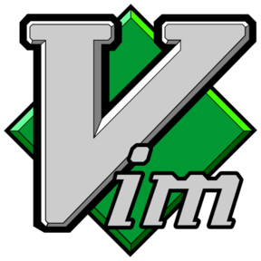
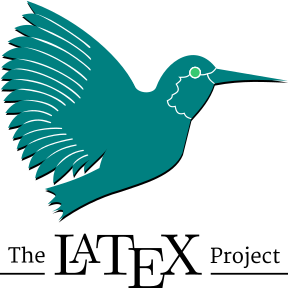
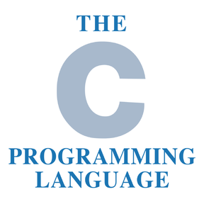

## Hi there 👋, I'm [Tianning Yuan](https://yuantn.github.io/).    

### About Me
- 🎓 I am a master candidate in [Pattern Recognition and Intelligent System Development Laboratory (PriSDL)](http://lamp.ucas.ac.cn/intro_en.html?lang=en) at [University of Chinese Academy of Sciences (UCAS)](http://english.ucas.ac.cn/), supervised by [Prof. Qixiang Ye](http://people.ucas.ac.cn/~qxye?language=en).

- 📚 My research interests include computer vision and machine learning, specifically for active learning and feature learning.

- 📧 Feel free to contact me [here](https://github.com/yuantn/yuantn/issues) or via yuantianning19@mails.ucas.ac.cn.

### My Repository

### My Github Statistics
 

<!--

-->

### Languages and Tools

<code></code>
<code></code>
<code></code>
<code></code>
<code></code>
<code></code>
<code></code>
<code></code>
<code></code>
<code></code>
<code></code>

<!--
**yuantn/yuantn** is a ✨ _special_ ✨ repository because its `README.md` (this file) appears on your GitHub profile.

Here are some ideas to get you started:

- 🔭 I’m currently working on ...
- 🌱 I’m currently learning ...
- 👯 I’m looking to collaborate on ...
- 🤔 I’m looking for help with ...
- 💬 Ask me about ...
- 📫 How to reach me: ...
- 😄 Pronouns: ...
- ⚡ Fun fact: ...
-->
