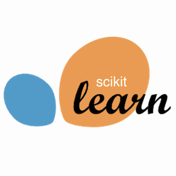

## Hi there 👋, I'm [Tianning Yuan](https://yuantn.github.io/).    

### About Me

- 🏢 I am an Algorithm Engineer at [Noah's Ark Lab](https://www.noahlab.com.hk) in [Huawei Technologies Co., Ltd.](https://www.huawei.com/en). My project leader is [Xinghao Chen](https://www.xinghaochen.xyz). 

- 🎓 I received my M.Eng. degree advised by [Prof. Qixiang Ye](http://people.ucas.ac.cn/~qxye?language=en) in Electronics and Communication Engineering at [University of Chinese Academy of Sciences (UCAS)](http://english.ucas.ac.cn) in July 2022.

- 📚 My research interests include Computer Vision and Machine Learning, specifically for Active Learning and Visual Object Detection. I am opening to all other interesting topics.

- 📧 Feel free to contact me [here](https://github.com/yuantn/yuantn/issues) or via yuantianning1@huawei.com.

### My Repository

### My Github Statistics
 

<!--

-->

### Languages and Tools

<code></code>
<code></code>
<code></code>
<code></code>
<code></code>
<code></code>
<code></code>
<code></code>
<code></code>
<code></code>
<code></code>
<code></code>
<!-- <code></code> -->
<!-- <code></code> -->
<!-- <code></code> -->

<!--
**yuantn/yuantn** is a ✨ _special_ ✨ repository because its `README.md` (this file) appears on your GitHub profile.

Here are some ideas to get you started:

- 🔭 I’m currently working on ...
- 🌱 I’m currently learning ...
- 👯 I’m looking to collaborate on ...
- 🤔 I’m looking for help with ...
- 💬 Ask me about ...
- 📫 How to reach me: ...
- 😄 Pronouns: ...
- ⚡ Fun fact: ...
-->
